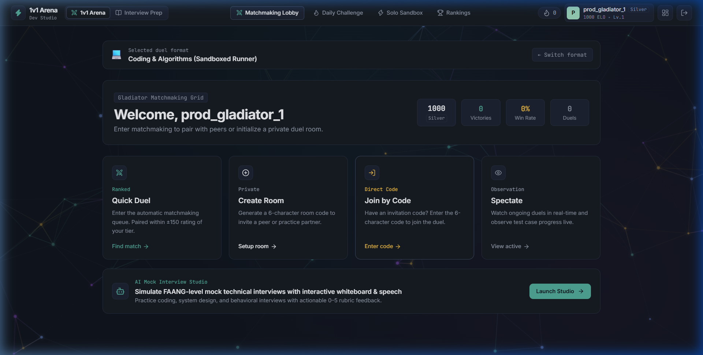
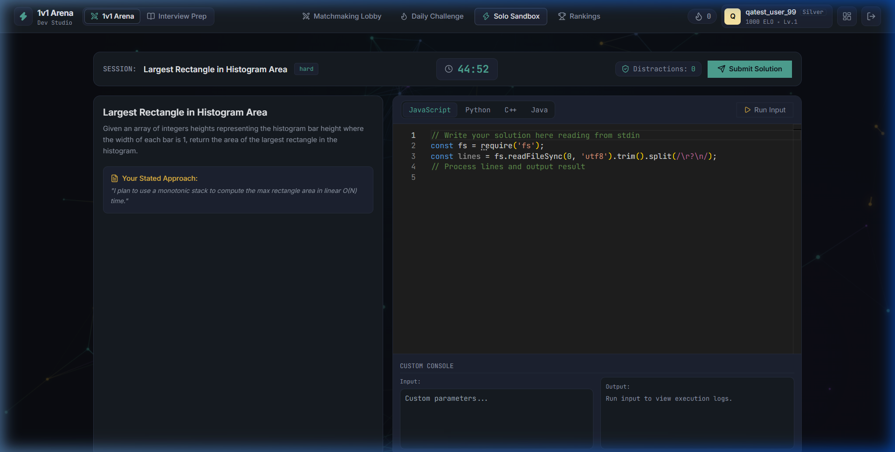
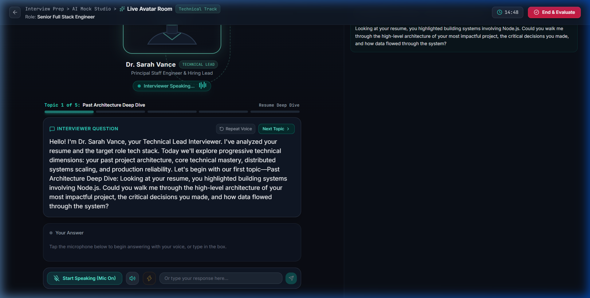
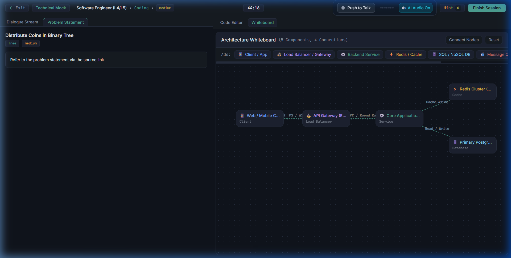
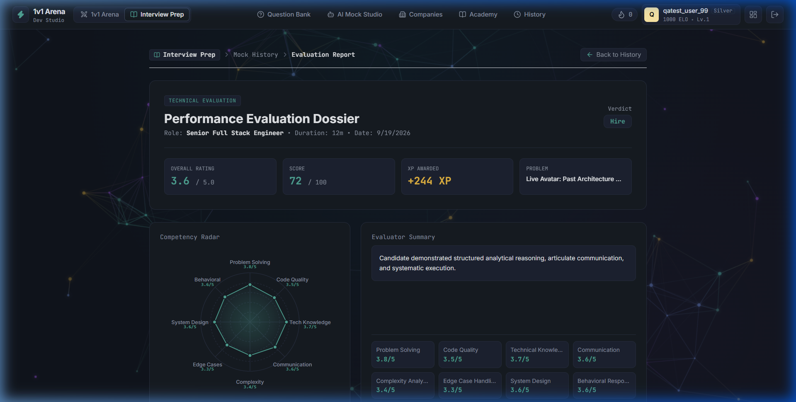
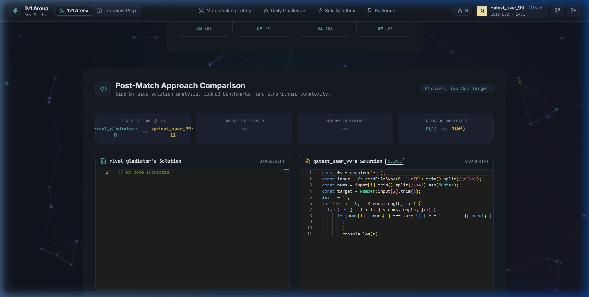
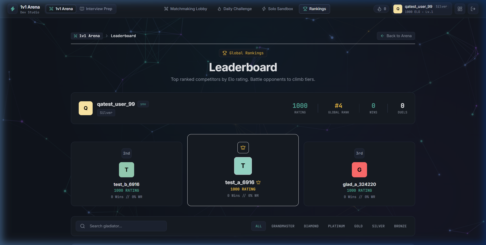
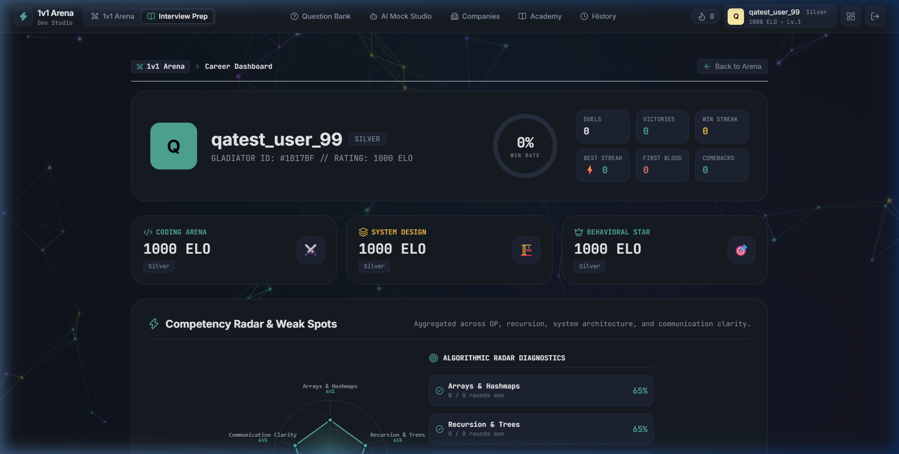
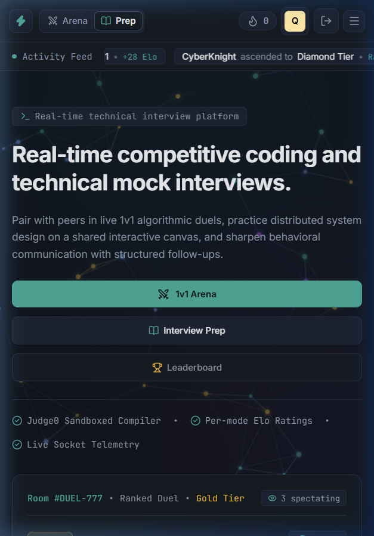
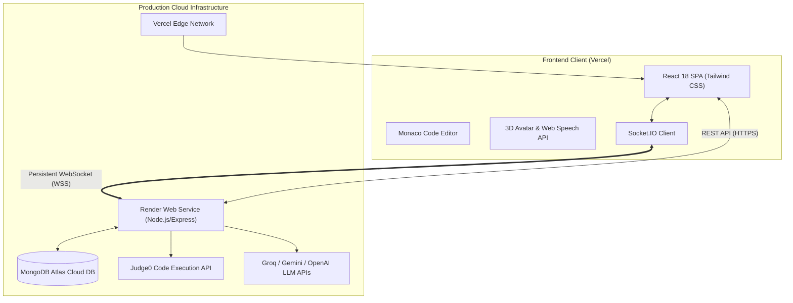

<div align="center">

# ⚡ 1v1 Coding Arena & Interview Prep AI

**The next-generation real-time competitive coding platform and AI-powered technical interview simulator.**

[](https://client-rust-kappa-90.vercel.app)
[](https://coding-arena-api.onrender.com)
[](LICENSE)
[](https://github.com/TechOrAlfaiz/1v1-Coding_Arena/stargazers)

<br/>

[🚀 Live Frontend App](https://client-rust-kappa-90.vercel.app) • [⚡ Production API](https://coding-arena-api.onrender.com/api/health) • [📖 Architecture](#-system-architecture) • [✨ Features](#-key-features) • [🛠️ Setup Guide](#-quick-start)

---

</div>

## 🔗 Live Deployments & Demo

| Service | Platform | Live URL | Description | Status |
| :--- | :--- | :--- | :--- | :---: |
| **Frontend Web App** | **Vercel** | **[https://client-rust-kappa-90.vercel.app](https://client-rust-kappa-90.vercel.app)** | Production SPA (1v1 Arena, AI Mock Interview, Leaderboard) | 🟢 **Live** |
| **Backend API & Sockets** | **Render** | **[https://coding-arena-api.onrender.com](https://coding-arena-api.onrender.com)** | Node/Express + Socket.IO Server ([Health Check](https://coding-arena-api.onrender.com/api/health)) | 🟢 **Live** |
| **Database Cluster** | **MongoDB Atlas** | `cluster0.s88pomd.mongodb.net` | 3,480+ indexed problems, matches, user ELO | 🟢 **Connected** |

> 💡 **Ready-to-Use Test Account:**
> - **Email:** `prod_gladiator_1@arena.dev`
> - **Password:** `Password123!`
> *(Or create a brand new gladiator profile instantly on the platform!)*

---

## 🌟 Overview

**1v1 Coding Arena** is a full-stack, cloud-deployed platform engineered for competitive programmers and software engineers preparing for high-stakes technical interviews at Tier-1 tech companies.

It unifies **low-latency real-time multiplayer coding battles** with a comprehensive **AI Mock Interview suite** featuring 3D avatar voice interaction, interactive system architecture whiteboarding, automated code execution, and deep multidimensional feedback reports.

---

## 📸 Screenshots Showcase

<div align="center">

### ⚔️ 1v1 Arena Matchmaking & Lobby
*Join queues, challenge friends via custom Room IDs, or compete in ranked matchmaking.*
<br/>


<br/><br/>

### 💻 Pro Code Editor & Live Test Runner
*Monaco-powered IDE with multi-language syntax highlighting, test cases, and instant evaluation.*
<br/>


<br/><br/>

### 🎙️ AI Technical Mock Interview (Live 3D Avatar)
*Interactive voice & video interview simulation with real-time feedback and probing questions.*
<br/>


<br/><br/>

### 🎨 System Architecture & Collaborative Whiteboard
*Design scalable distributed systems with live diagramming alongside coding problems.*
<br/>


<br/><br/>

### 📊 Comprehensive AI Candidate Evaluation Report
*In-depth score breakdown across DSA mastery, communication, system design, and optimization tips.*
<br/>


<br/><br/>

### 🏆 1v1 Duel Victory & ELO Progression
*Head-to-head battle outcomes with instantaneous ELO rating updates and tier progressions.*
<br/>


<br/><br/>

### 🥇 Global Leaderboard & Tier Rankings
*Live competitive rankings ranging from Bronze to Grandmaster gladiator status.*
<br/>


<br/><br/>

### 📈 User Dashboard & Performance Analytics
*Track your win-loss ratios, rating history, streak achievements, and interview stats.*
<br/>


<br/><br/>

### 📱 Responsive Mobile Experience
*Adaptive interface crafted for practicing coding questions and reviewing reports on mobile devices.*
<br/>


</div>

---

## ✨ Key Features

### ⚔️ Real-Time 1v1 Coding Arena
- **Synchronized Matchmaking**: Match instantly with gladiators in your ELO bracket or share room codes with peers.
- **Synced Timer & State**: 15-minute high-octane countdown synchronized via low-latency Socket.IO WebSockets.
- **Judge0 Execution Engine**: Real-time compilation and automated testing against visible and hidden test suites.
- **Chess-Style ELO Rating System**: Win/loss rating calculations update dynamically after every match.

### 🤖 AI Technical Interview Suite
- **Interactive 3D Avatar**: Conduct realistic mock interviews with conversational AI speech synthesis and recognition.
- **Multi-Modal Interview Options**: Standard DSA Coding Lab, Behavioral Screening, and System Design Whiteboard.
- **10-Factor AI Candidate Evaluation**: Generates detailed performance diagnostics, code complexity analysis ($O(N)$ Big-O verification), and customized improvement recommendations.

### 📚 Curated Question Bank (3,400+ Problems)
- **Company-Specific Collections**: Practice questions categorized by Google, Meta, Amazon, Apple, Microsoft, Uber, Netflix, and more.
- **Filter by Topic & Difficulty**: Binary Search, Dynamic Programming, Graphs, Trees, Heaps, and System Architecture.
- **Daily Challenge Engine**: Automated daily challenge with UTC countdown timer and streak tracker.

### 🛡️ Enterprise Security & Robustness
- **JWT Stateless Authentication**: Secure token verification with encrypted password hashing (bcrypt).
- **Graceful Error Handling & Fallbacks**: Resilience against API throttles with internal mock test evaluation fallbacks.
- **Strict CORS & Routing**: Wildcard regex matching for preview and production domains with SPA deep-link routing.

---

## 🏗️ System Architecture



---

## 🗂️ Project Structure

```
1v1-coding-arena/
├── client/                      # React frontend
│   ├── public/                  # Assets, favicon, _redirects
│   ├── src/
│   │   ├── components/          # Navbar, Footer, Modal, Timer
│   │   ├── context/             # AuthContext, SocketContext
│   │   ├── pages/               # Arena, Interview, Dashboard, Lobby, Questions
│   │   ├── utils/               # API clients, helpers
│   │   ├── App.js               # Route declarations & Protected Routes
│   │   └── index.css            # Custom CSS animations & Tailwind utilities
│   ├── vercel.json              # Vercel SPA rewrite configuration
│   └── package.json
│
├── server/                      # Node.js + Express backend
│   ├── controllers/             # Auth, Match, Question, Leaderboard, Daily
│   ├── middleware/              # JWT verification, CORS, error handling
│   ├── models/                  # User, Match, Question, DailyChallenge schemas
│   ├── routes/                  # REST API endpoints
│   ├── services/                # Daily challenge cron & evaluation services
│   ├── socket/                  # Socket.IO room, matchmaking, and duel handlers
│   ├── utils/                   # ELO calculator, Judge0 client
│   ├── index.js                 # HTTP + WebSocket server bootstrap
│   └── package.json
│
├── docs/
│   └── screenshots/             # Production UI showcase screenshots
├── render.yaml                  # Render deployment blueprint
└── README.md
```

---

## 🚀 Quick Start

### 📋 Prerequisites
- [Node.js](https://nodejs.org) (v18 or higher recommended)
- [MongoDB Atlas](https://www.mongodb.com/cloud/atlas) or local MongoDB instance
- [RapidAPI Judge0 API Key](https://rapidapi.com/judge0-official/api/judge0-ce) *(optional, fallback mock runner built-in)*
- [Groq](https://groq.com) or [OpenAI](https://openai.com) API Key *(for AI Mock Interview features)*

---

### 1️⃣ Clone the Repository

```bash
git clone https://github.com/TechOrAlfaiz/1v1-Coding_Arena.git
cd 1v1-coding-arena
```

---

### 2️⃣ Backend Setup

```bash
cd server
npm install
```

Create a `.env` file in the `server/` directory:

```env
PORT=5000
NODE_ENV=development
CLIENT_URL=http://localhost:3000
MONGO_URI=your_mongodb_connection_string
JWT_SECRET=your_jwt_super_secret_key
RAPIDAPI_KEY=your_rapidapi_judge0_key
GROQ_API_KEY=your_groq_or_llm_key
```

Seed the database with default problems and start the server:

```bash
node seed.js
npm run dev
```

---

### 3️⃣ Frontend Setup

```bash
cd ../client
npm install
```

Create a `.env` file in the `client/` directory:

```env
REACT_APP_SERVER_URL=http://localhost:5000
REACT_APP_SOCKET_URL=http://localhost:5000
```

Start the React development server:

```bash
npm start
```

Open [http://localhost:3000](http://localhost:3000) in your browser.

---

## 🌐 Production Deployment

### Frontend (Vercel)
1. Import the repository into [Vercel](https://vercel.com).
2. Set the Root Directory to `client`.
3. Add environment variables:
   - `REACT_APP_SERVER_URL`: `https://coding-arena-api.onrender.com`
   - `REACT_APP_SOCKET_URL`: `https://coding-arena-api.onrender.com`
4. Deploy! Rewrites in `client/vercel.json` handle SPA routing automatically.

### Backend (Render)
1. Create a **Web Service** on [Render](https://render.com) connected to the GitHub repository.
2. Configure settings:
   - **Root Directory:** `server`
   - **Build Command:** `npm install`
   - **Start Command:** `node index.js`
3. Add environment variables: `MONGO_URI`, `JWT_SECRET`, `NODE_ENV=production`, `CLIENT_URL=https://client-rust-kappa-90.vercel.app`, `RAPIDAPI_KEY`, and `GROQ_API_KEY`.
4. Deploy! Render maintains long-running WebSocket connections required for live 1v1 duels.

---

## 📡 Core API & WebSocket Protocol

### REST Endpoints

| Method | Endpoint | Description |
| :--- | :--- | :--- |
| `POST` | `/api/auth/register` | Create a new user account |
| `POST` | `/api/auth/login` | Authenticate user & return JWT token |
| `GET` | `/api/questions` | Query company-tagged DSA questions with pagination |
| `GET` | `/api/daily` | Fetch today's featured challenge & timer countdown |
| `GET` | `/api/leaderboard` | Retrieve global gladiators ranked by ELO |
| `GET` | `/api/health` | Service uptime and health check |

### Real-Time Socket.IO Events

| Event | Direction | Payload / Purpose |
| :--- | :--- | :--- |
| `create_room` | Client ➔ Server | Create a private 1v1 match room |
| `join_room` | Client ➔ Server | Join an existing room via Room ID |
| `match_found` | Server ➔ Client | Notifies matched players and sends problem |
| `timer_sync` | Server ➔ Client | Synchronizes match countdown for both players |
| `code_change` | Bidirectional | Real-time code sync & typing indicators |
| `submit_code` | Client ➔ Server | Submits code for execution and evaluation |
| `match_ended` | Server ➔ Client | Declares match winner, draw, and ELO rating changes |

---

## 🤝 Contributing

Contributions are welcome! If you'd like to improve the platform:

1. Fork the Project
2. Create your Feature Branch (`git checkout -b feature/AmazingFeature`)
3. Commit your Changes (`git commit -m 'Add some AmazingFeature'`)
4. Push to the Branch (`git push origin feature/AmazingFeature`)
5. Open a Pull Request

---

## 📜 License

Distributed under the MIT License. See `LICENSE` for more information.

---

<div align="center">
  <sub>Engineered with ⚡ for competitive coders worldwide. Star ⭐ this repository if you find it helpful!</sub>
</div>
